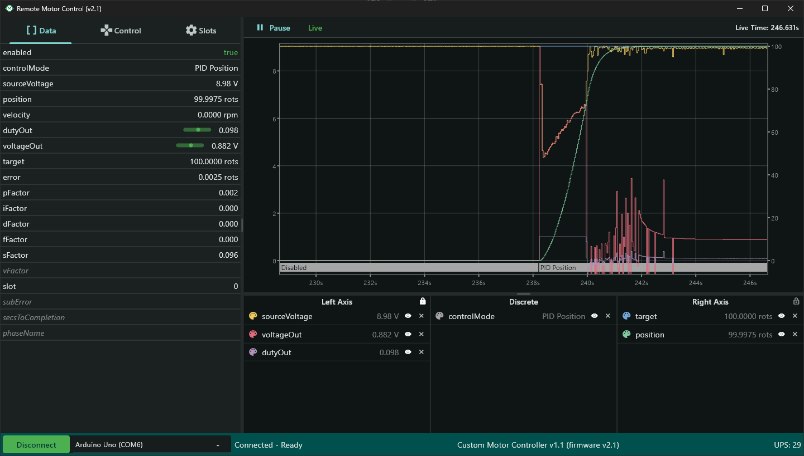
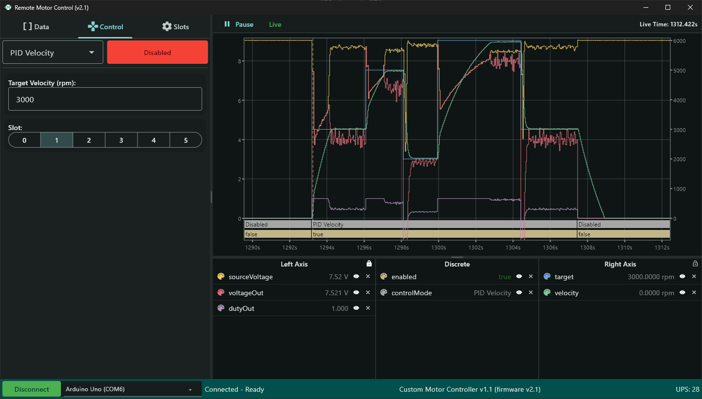

# SM2 Study - CMC (Custom Motor Controller)
In this independent study, I set out to create my own Arduino Uno-based motor controller and all accompanying software from scratch.
This repository contains the software components of the project. This is split into two parts: the firmware, and the desktop software.

This project took inspiration from various other programs and products I have worked with, the primary three being [CTRE Phoenix Tuner X](https://v6.docs.ctr-electronics.com/en/stable/docs/tuner/index.html), [CTRE Phoenix 6](https://v6.docs.ctr-electronics.com/en/latest/index.html), and [AdvantageScope](https://docs.advantagescope.org/).

## Firmware
This is the code that runs on the Arduino.
It was written in C++ with the Arduino framework using PlatformIO and is intended for use only with Arduino Unos.

## Desktop software

*PID Positional control running live on the CMC

*PID Velocity control running live on the CMC

This is the software that runs on a desktop device.
It allows a user to send control signals and monitor live data from the motor controller. It was written in Dart using Flutter and can (in theory) run on Windows, MacOS, and Linux ; I have only tested it on Windows.
